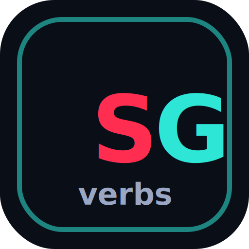

# Proyecto: "SpanGlish"  —  "English App v2"

 



`<link version 1>` : <https://sebalopezx.github.io/app-ingles/>

`<link version 2>` : <https://sebalopezx.github.io/app-ingles-v2/>


## Descripción — Description

App para aprender y memorizar los verbos en pasado del ingles (infinitivo, pasado simple, participio y traduccion). 
Es la version 2 de mi primer proyecto, reconstruida con codigo moderno y mejor estructura.

> **English**:
> - An app for learning and memorizing English verbs in their different forms: infinitive, simple past, past participle, and their translation.
> - This is version 2 of my first project, rebuilt with modern technologies, cleaner code, and a better overall architecture.

## Como usar — How to use

- Verbos — Pasa el mouse en PC o toca en movil una palabra para ver su traduccion al instante.
    - Marca como aprendida con el check de cada tarjeta. Tu progreso se guarda solo.
    - Busca en ingles o espanol, filtra por regulares/irregulares, mezcla y revela todo.
- Reloj — Para aprender dias, meses y hora.
- Números — escribe el número en inglés y verifica tu respuesta. Tus aciertos y errores quedan guardados.
- Días y meses — puedes arrastrar cada palabra a su posición, o hacer clic en una para seleccionarla y luego clic en el recuadro donde creas que va.

> **English**:
> - Verbs — Hover over a word on desktop or tap it on mobile to instantly see its translation.
>   - Mark verbs as learned using the checkmark on each card. Your progress is saved automatically.
>   - Search in English or Spanish, filter by regular or irregular verbs, shuffle the cards, and reveal all translations.
> - Clock — Practice days, months, and telling the time.
> - Numbers — Type the number in English and check your answer. Your correct and incorrect answers are saved.
> - Days & Months — Drag each word to its correct position, or click a word to select it and then click the box where you think it belongs.

## Tecnologias — Technologies

- Vue 3 + Vite 6 + Vue Router
- CSS
- PWA instalable/offline with `vite-plugin-pwa`
- LocalStorage
- JSON (Database)

## Estructura — Structure

```text
src/
|-- data/          JSON con los verbos — Verb data
|-- models/        logica de datos y progreso — Data models and progress logic
|-- composables/   estado y reloj — Shared state and clock logic
|-- components/    componentes reutilizables — Reusable Vue components
|-- views/         paginas — Pages / Home / Verbs / Calendar
|-- router/        rutas de Vue — Router 
`-- styles/        estilos generales — global styles
```

## Desarrollo local — Local development

```bash
docker compose up --build
```

La app queda en `http://localhost:5173`.

## Comandos — Commands

```bash
npm install
npm run dev
npm run build
npm run preview
```
